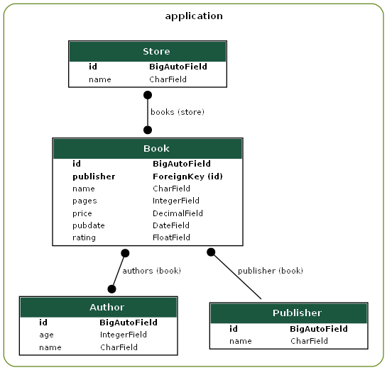
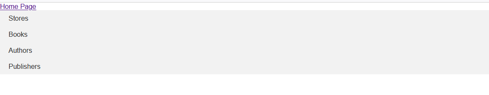

# db_train

This is db_diagram of this project

=========

How to run project

=========
Please load fixtures frome data.json by loaddata
You need to add path main/ into you default localhost link.

Now you can choose necessary list and after you can watch an information
about every element of this application.
You can easy to croos over tables and theirs elements.